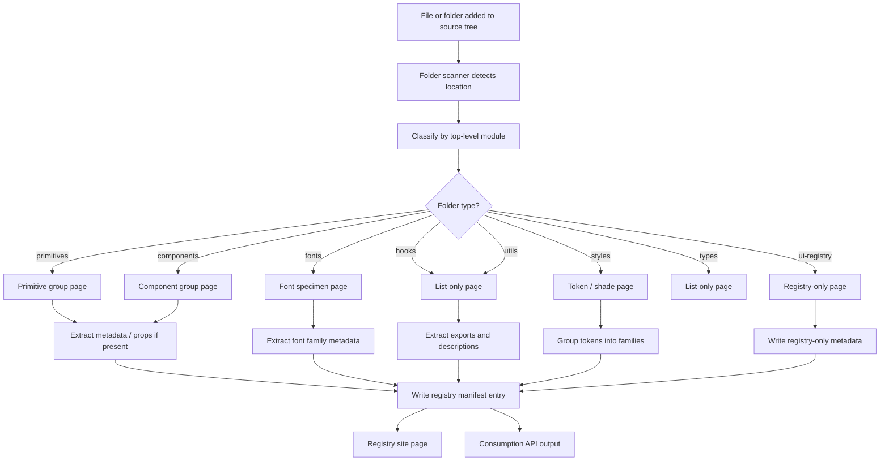

# Registry Folder Framework Outline

## Goal
Build a folder-first registry framework that keeps navigation predictable, avoids component-sprawl, and registers content based on where it lives in the source tree.

## Principles

- Folders are the primary unit of organization.
- Pages map to folder groups, not individual components by default.
- Deep component drill-down only happens when a folder already represents a meaningful module boundary.
- Registry-only copies live in `packages/ui/src/ui-registry`.
- The system should avoid broad auto-generated barrels inside empty or placeholder directories.

## Proposed Structure

### `packages/ui/src/primitives`
Primary navigation for primitive groups.

- `buttons`
- `charts`
- `data-grid`
- `dropdowns`
- `forms`
- `image-blocks`
- `inputs`
- `layouts`
- `links`
- `lists`
- `menus`
- `popovers`
- `sections`
- `skeleton`
- `studio-blocks`
- `tables`
- `tabs`
- `textarea`
- `timelines`
- `typography`
- `ui-core`
- `users`

### `packages/ui/src/components`
Primary navigation for component groups.

- `_shared-props`
- `_shared-ui`
- `metrics-charts`
- `metrics-core`
- `metrics-errors`
- `metrics-feedback`
- `metrics-layouts`
- `metrics-sections`
- `metrics-tables`
- `metrics-timeline`

### Supporting folders

- `context`
- `fonts`
- `hooks`
- `icons`
- `lib`
- `styles`
- `types`
- `ui-registry`
- `utils`

## Page Templates to Create

### 1. Folder Landing Page
Used for top-level category folders like `primitives`, `components`, `fonts`, `hooks`, `styles`, `types`, `utils`.

Purpose:

- describe the folder
- show all child groups
- provide navigation into the next level
- show the registry surface available from that folder

### 2. Group Page
Used for meaningful subfolders like `primitives/buttons`, `primitives/layouts`, `components/metrics-layouts`.

Purpose:

- list the files in the group
- show the component or asset summary
- display usage notes and registry metadata
- provide direct links to the source file(s)

### 3. Visual Component Page
Used only when the folder contains a displayable component or example.

Purpose:

- render the component preview
- show props and metadata
- show source location
- show registry dependencies

### 4. List-Only Page
Used for non-visual modules like hooks, utils, and some types.

Purpose:

- list exported items
- summarize purpose
- show import examples
- avoid fake previews

### 5. Token / Shade Page
Used for styles and color families.

Purpose:

- group shades into families
- avoid exploding every shade into separate cards
- show the primary color and its supporting range together
- mark special tokens separately when needed

### 6. Font Specimen Page
Used for `fonts`.

Purpose:

- show font family groupings
- preview weight/size combinations
- show sample text and usage guidance

### 7. Registry-Only Page
Used for files copied into `ui-registry`.

Purpose:

- isolate registry-specific variants from the main UI source tree
- preserve registry-specific naming
- keep public registry output stable even if the main UI component changes later

## Connection Logic

## Automation Flow

### 1. File lands in a folder

- A component, helper, or asset is copied into a known folder.
- The folder path determines the page type and registry behavior.

### 2. Scanner runs

- Detect new or changed files in the folder tree.
- Ignore empty folders and excluded junk files.
- Identify the module family from the folder path.

### 3. Metadata is inferred or read

- Extract props for visual components when possible.
- Read explicit metadata if a local metadata file exists.
- Infer display mode when the folder maps to a known template type.

### 4. Registry entry is generated or updated

- Write the folder-level registry metadata.
- Keep the entry tied to the source path.
- Avoid broad barrel generation in unrelated folders.

### 5. Registry site updates

- The matching page template reads the updated manifest.
- The sidebar/navigation group appears in the correct folder section.
- The page renders the correct template for the module type.

### 6. Consumption API updates

- The public registry output is refreshed.
- Downstream apps consume the updated entry from the registry surface.

## First Implementation Slice

1. Implement folder classification.
2. Implement folder landing pages for `primitives` and `components`.
3. Implement list-only pages for `hooks`, `types`, and `utils`.
4. Implement token family grouping for `styles`.
5. Add registry-only page support for `ui-registry`.
6. Add one simple component group and one list-only group to prove the flow.

## What Should Not Happen

- Do not render every component individually by default.
- Do not create barrel files in empty folders.
- Do not flatten `primitives` or `components` into one global list.
- Do not mix registry-only copies with the source UI implementation.
- Do not switch to component-first navigation.

## Notes For Gemini

- Work one folder family at a time.
- If a folder is empty, leave it empty.
- If a folder has only one or two meaningful files, keep the page simple.
- Stop and report the first blocker instead of trying to auto-fix the entire tree.
