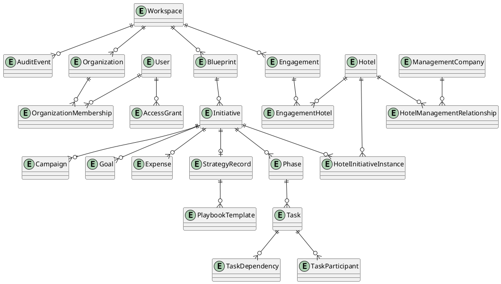

# SPEC-1-Hotel-Strategy-Execution-Platform

## Background

The Hotel Strategy Execution Platform will initially support consulting agents delivering Commercial Strategy engagements for hotels. It will provide one system to plan strategic initiatives, coordinate tasks and campaigns, track expenses, report progress, and preserve successful strategies for reuse.

The initial customer progression is expected to be:

```text
Internal Consulting Agents
        ↓
Similar Hotel Consulting Agencies
        ↓
Independent Hotels
        ↓
Small Regional Management Companies and Hotel Groups
```

Hotels and consulting teams commonly manage strategy execution across spreadsheets, task applications, calendars, presentation files, campaign platforms, budgeting tools, and reporting systems. This fragmentation makes it difficult to connect strategy, execution, ownership, spending, campaign activity, measurable outcomes, and institutional knowledge.

The platform will establish a continuous lifecycle:

```text
Define Strategy
      ↓
Create Initiative
      ↓
Plan and Assign Work
      ↓
Execute Tasks and Campaigns
      ↓
Track Expenses, Goals, and Results
      ↓
Generate Reports and Presentations
      ↓
Convert Completed Work into a Strategy Record
      ↓
Reuse Proven Strategies and Templates
```

The primary modules are:

1. **Strategies** — stores Blueprints and completed Strategy Records.
2. **Tasks** — manages Planning, Started, Waiting, On-Hold, Cancelled, and Completed Initiatives.
3. **Campaigns** — manages campaign goals, budgets, creative, production, target segments, and performance.
4. **Playbook** — stores reusable execution knowledge, templates, variables, reminders, and standard strategic events.
5. **Planning Settings** — stores budgets, forecasts, channel goals, market segments, and contribution assumptions.
6. **Reporting** — produces action plans, status reports, campaign reports, expense views, and predefined presentation slides.
7. **Metrics** — a separate full BI module within the same application. It will be scoped independently but integrated through shared goals, dimensions, targets, and result references.

The MVP will optimize for the following operational lifecycle:

```text
Strategies → Tasks → Campaigns → Reporting → Strategies Record / Playbook
```

Budget, forecast, expense, and performance data may initially be entered manually or imported. Advanced BI capabilities remain owned by the separately designed Metrics module.

---

## Requirements

### MoSCoW Prioritization

#### Must Have

- Multi-tenant support for Agencies, Management Companies, Hotels, Vendors, and users.
- A single immutable Main Entity per workspace.
- Engagement-based work ownership when an Agency is the Main Entity.
- Optional engagement ownership when a Hotel or Management Company is the Main Entity, except where agency-supported work requires an engagement.
- Strategy Blueprint creation and conversion into Task Initiatives.
- Quick Tasks and full Initiatives.
- Multi-hotel Initiative distribution with hotel-specific linked execution instances.
- Tasks, subtasks, phases, meetings, campaigns, expenses, goals, notes, files, and dependencies.
- Single Primary Key Stakeholder per task.
- Secondary people, departments, vendors, and watchers.
- Flexible scheduling using fixed dates, durations, relative offsets, and dependencies.
- Required Lead Time and Minimum Required Duration controls.
- Force-push and publish-and-review schedule updates.
- Standard and weighted progress calculations.
- Campaign planning and expense integration.
- Completion-to-Record workflow back into the Strategies module.
- Reusable Playbook templates and variables.
- Role- and scope-based access control.
- Import/export for tasks and templates.
- Audit history for ownership, dates, overrides, status changes, and publication events.
- Reporting and predefined slide layouts.
- Integration contract with the separate Metrics module.

#### Should Have

- Calendar synchronization with Outlook and Google Calendar.
- Linked meetings and meeting notes.
- Holiday and working-day calendar rules.
- Event-based reminders and Playbook prompts.
- Multi-property, region, brand, and collection roll-ups.
- Campaign creative upload and display.
- Suggestions for goals based on linked budget, market segment, event, holiday, and strategy type.
- Configurable approval and review workflows.
- Portfolio-level dashboards.

#### Could Have

- Automated hotel-system, media-platform, and accounting integrations.
- Suggested strategies based on prior Records and Metrics performance.
- AI-generated presentation narratives and executive summaries.
- Advanced capacity planning.
- Cross-agency template marketplace.
- Anonymous benchmarking across clients.

#### Won’t Have in the Initial MVP

- Full BI implementation inside this specification.
- Deep automated PMS, CRS, accounting, or ad-platform integrations.
- Automatic parent-to-hotel updates without explicit user action.
- Direct Main Entity changes after workspace activation.

---

### Organization and Tenancy Model

The platform will treat the following as first-class entities:

- Agency
- Management Company
- Hotel
- Vendor
- User
- Workspace
- Engagement

A workspace has exactly one **Main Entity**:

```text
AGENCY
MANAGEMENT_COMPANY
HOTEL
```

The Main Entity is immutable after the workspace begins operating. Any ownership change requires a controlled migration or transfer process.

The Main Entity controls:

- Record ownership
- Engagement requirements
- User administration
- Default permissions
- Branding
- Billing
- Reporting hierarchy
- Template ownership
- Playbook ownership
- Data export rights

#### Agency as Main Entity

- Every task and campaign must belong to an Engagement.
- Every Engagement must include at least one Hotel.
- Work cannot be created directly against a Hotel outside an Engagement.
- The Agency owns workspace administration, engagement records, templates, and Playbook content.

#### Hotel as Main Entity

- Tasks and campaigns may belong directly to the Hotel.
- An Engagement is optional.
- Agency-supported work may be linked to an Engagement.
- Closing an Engagement does not remove Hotel-owned internal work.

#### Management Company as Main Entity

- Internal work may be created without an Engagement.
- Work may target the Management Company, one Hotel, or multiple managed Hotels.
- Agency-supported work must belong to an Engagement.
- Portfolio Initiatives may be distributed to multiple Hotels while retaining separate Hotel-level execution records.

---

### Management Company and Hotel Relationships

A Hotel may have only one active Management Company at a time.

Historical Management Company relationships must be retained using effective dates.

```text
hotel_management_relationship
- id
- hotel_id
- management_company_id
- effective_start_date
- effective_end_date nullable
- is_active
```

A database constraint or application-level exclusion rule must prevent overlapping active date ranges for the same Hotel.

An Engagement may exist as:

```text
Agency → Hotel
```

or:

```text
Agency → Management Company → One or More Hotels
```

The Management Company relationship is optional for direct Hotel engagements.

Every Engagement must have:

- One Agency
- Zero or one Management Company
- One or more Hotels
- Start and end dates
- Status
- Named participants
- Permissions and access scopes

Hotels may be added to or removed from an Engagement at different points in time.

---

### Data Ownership and Historical Integrity

The Agency is the initial paying customer and primary owner of Agency-led engagement workspaces.

The system must preserve the ownership and relationship context that existed when work was created.

Tasks, campaigns, expenses, reports, goals, metric links, and Strategy Records must retain:

- Original Main Entity
- Original Engagement
- Participating organizations
- Hotel scope
- Ownership at creation
- Management Company relationship at creation
- Subsequent transfer or migration records

Historical records must not be rewritten when a Hotel changes Management Company.

---

### User Membership and Access Control

Users belong primarily to an organization:

- Agency
- Management Company
- Hotel
- Vendor

A user may then receive access grants at one or more scopes:

- Entire workspace
- Specific Engagement
- Specific Hotel
- Group of Hotels
- Specific Initiative
- Specific Campaign
- Specific task
- Explicitly assigned work only

External vendors and external users may receive either narrow or broad access. The access level is selected by an administrator.

The default for external users is explicitly assigned work only.

Access grants may include:

```text
VIEW
COMMENT
UPDATE_STATUS
ADD_NOTES
UPLOAD_FILES
EDIT
CREATE
ASSIGN
VIEW_EXPENSES
MANAGE_EXPENSES
VIEW_REPORTS
EXPORT
ADMINISTER_ACCESS
```

Explicit denials override broader permissions.

Initial role templates:

- Workspace Administrator
- Agency Consultant
- Management Company Leader
- Hotel Leader
- Department Manager
- Hotel Contributor
- Vendor or External Contributor
- Read-Only Stakeholder

Roles are configurable permission bundles, not hard-coded authorization rules.

---

### Strategy and Initiative Lifecycle

The lifecycle spans the Strategies and Tasks modules.

```text
Strategies Module                 Tasks Module                    Strategies Module

BLUEPRINT
    └── Move to Planning ───────> PLANNING
                                   ├── WAITING
                                   ├── ON_HOLD
                                   └── STARTED
                                        ├── WAITING
                                        ├── ON_HOLD
                                        ├── CANCELLED
                                        └── COMPLETED
                                              └── Convert to Record ───────> RECORD
```

The primary lifecycle is:

```text
BLUEPRINT → PLANNING → STARTED → COMPLETED → RECORD
```

#### Blueprint

Blueprint exists only in the Strategies module.

It defines reusable strategy structure, including:

- Strategy objective
- Phases
- Tasks
- Dependencies
- Suggested assignments
- Default dates and durations
- Campaign structures
- Goals
- Expense categories
- Reports
- Playbook variables
- Event and holiday associations

Moving a Blueprint to Planning creates a Main Initiative in the Tasks module.

The original Blueprint remains available for reuse.

#### Planning

Planning exists only in the Tasks module.

Planning supports:

- Schedule setup
- Assignment
- Budget preparation
- Campaign preparation
- Goal definition
- Dependency calculation
- Lead-time validation preview
- Duration validation preview
- Hotel distribution
- Review and approval

#### Started

Started exists only in the Tasks module.

The `PLANNING → STARTED` transition triggers:

- Required Lead Time validation
- Minimum Required Duration validation
- Required assignment checks
- Dependency checks
- Blocking rule checks
- Reminder activation
- Execution tracking
- Linked campaign activation, when configured

#### Completed

Completed exists only in the Tasks module.

It supports final reconciliation of:

- Tasks
- Expenses
- Campaign performance
- Goals
- Metric references
- Outcomes
- Lessons learned
- Final reports

#### Record

Record exists only in the Strategies module.

When a Completed Initiative is converted to a Record, it is removed from active Task views and retained as historical strategic knowledge.

A Record preserves:

- Original Blueprint reference
- Initiative configuration
- Hotel instances
- Tasks and dependencies
- Planned and actual dates
- Assignments
- Campaign details
- Creative assets
- Planned and actual expenses
- Goals and linked Metrics results
- Overrides
- Final outcomes
- Lessons learned
- Recommended future changes

Normal users should not rewrite execution history. Post-completion changes should be stored as versioned amendments.

---

### Secondary Initiative States

The following states may be entered from both Planning and Started:

- Waiting
- On-Hold
- Cancelled

The system must retain the prior primary state so an Initiative can return to the correct state.

#### Waiting

Waiting is used when progress depends on an expected condition.

Required fields:

- Waiting reason
- Expected resolution date, when known
- Responsible follow-up user
- Optional reminder rule
- Previous primary status

#### On-Hold

On-Hold is used for a deliberate pause not represented by a normal task dependency.

Required fields:

- Hold reason
- User placing the hold
- Hold date
- Expected review date
- Date-shift behavior after release
- Previous primary status

#### Cancelled

Cancelled may be entered from Planning or Started.

Required fields:

- Cancellation reason
- Effective date
- Authorizing user
- Treatment of open tasks
- Treatment of committed expenses
- Treatment of active campaigns
- Decision on whether to create a partial Strategy Record

A Cancelled Initiative may be:

```text
CANCELLED → ARCHIVED WITHOUT RECORD
```

or:

```text
CANCELLED → RECORD
```

---

### Quick Tasks and Initiatives

A Quick Task is a lightweight action item intended for rapid capture and completion.

Quick Tasks support:

- Title
- Description
- Hotel or Engagement scope
- Primary Key Stakeholder
- Secondary participants
- Due date
- Status
- Notes
- Attachments
- Tags
- Meeting reference

A Quick Task may be promoted into an Initiative.

Promotion must preserve:

- Original title and description
- Assignees
- Due date
- Notes
- Attachments
- Activity history
- Source meeting reference
- Audit trail

A full Initiative is the parent object for:

- Phases
- Tasks and subtasks
- Meetings
- Campaigns
- Goals
- Metric links
- Expenses
- Files
- Creative assets
- Status reporting
- Final outcomes
- Strategy Record creation

---

### Multi-Hotel Initiative Distribution

A parent Initiative may be assigned to one Hotel or distributed to multiple Hotels.

Each participating Hotel receives an independent **Hotel Initiative Instance** linked to the parent Main Initiative.

The parent stores shared information such as:

- Strategic objective
- Standard task structure
- Baseline schedule
- Suggested assignments
- Common campaign framework
- Standard goals
- Reporting layouts
- Blueprint source

Each Hotel Initiative Instance stores:

- Local assignments
- Local dates
- Local task status
- Local expenses
- Local notes
- Local files
- Local campaign details
- Local goal targets
- Local results
- Local overrides

Hotel instances remain linked to the Main Initiative for consolidated reporting.

Parent changes may be pushed to:

- All linked Hotel instances
- Selected Hotel instances only

Updates never apply automatically.

The user must be able to choose:

- Fields being published
- Target Hotels
- Whether local values are preserved or overwritten
- Force push
- Publish-and-review

Changes from Hotel instances do not automatically modify the Main Initiative.

---

### Progress Tracking

The platform must support two progress methods.

#### Standard Completion

```text
Completed Applicable Tasks ÷ Total Applicable Tasks × 100
```

Tasks marked Not Applicable are excluded.

#### Weighted Completion

Each phase, milestone, or task may be assigned a weight.

```text
Progress = Σ(Item Completion Percentage × Item Weight)
```

Active weights must total 100 percent.

When an item becomes Not Applicable, remaining weights are normalized.

The Main Initiative must show:

- Overall portfolio progress
- Progress by Hotel
- Progress by phase
- Standard task completion
- Weighted completion
- Overdue items
- Blocked items
- At-risk Hotels

---

### Task Assignment Model

Each task has exactly one **Primary Key Stakeholder**.

The stakeholder’s assigned department determines the Primary Department assignment.

The task stores both:

```text
primary_stakeholder_user_id
primary_department_id
```

The Primary Department must be snapshotted at the time of assignment so historical reporting remains accurate if the user changes departments later.

Additional participants may include:

- Secondary people
- Secondary departments
- Vendors
- Watchers

Only the Primary Key Stakeholder is used for:

- Primary accountability
- Overdue ownership
- Department roll-up reporting
- Escalation ownership

---

### Scheduling Modes

Each Initiative, phase, or task must use one authoritative scheduling mode.

#### Fixed Dates

Inputs:

- Planned Start Date
- Planned End Date

#### Start Plus Duration

Inputs:

- Planned Start Date
- Duration

Output:

- Calculated End Date

#### End Minus Duration

Inputs:

- Planned End Date
- Duration

Output:

- Calculated Start Date

#### Dependency Calculated

Inputs:

- Anchor event
- Offset
- Duration

Outputs:

- Calculated Start Date
- Calculated End Date

Fixed start/end inputs and duration-derived inputs are mutually exclusive as the authoritative source.

Supported duration units:

- Calendar days
- Working days
- Configured property operating-calendar days

---

### Initiative-Relative Scheduling

All tasks and phases may be tied to a single Initiative Start Date.

Examples:

```text
Task A starts 10 days after Initiative Start.

Task B starts when Task A starts.

Task C starts 3 days after Task A starts.

Task D starts 5 days before Task A planned completion.

Task E starts 2 days after Task A actual completion.
```

When the Initiative Start Date changes, the dependency graph must recalculate all affected dates.

The system must support recalculation for:

- All sections
- Selected phases
- Selected task groups
- Selected tasks
- All Hotel instances
- Selected Hotel instances

The update method may be:

- Force push
- Publish-and-review

---

### Dependencies

Tasks may have one or more dependency conditions.

Supported triggers include:

```text
INITIATIVE_START
INITIATIVE_FINISH
PHASE_START
PHASE_FINISH
PREDECESSOR_STARTED
X_DAYS_AFTER_PREDECESSOR_STARTED
X_DAYS_BEFORE_PREDECESSOR_PLANNED_COMPLETION
PREDECESSOR_PLANNED_COMPLETION
PREDECESSOR_ACTUAL_COMPLETION
X_DAYS_AFTER_PREDECESSOR_COMPLETION
```

Positive and negative offsets must be supported where valid.

A dependent task may combine conditions.

Example:

```text
Task B becomes Ready when:

Task A is Completed
AND
14 days have passed since Initiative Start
```

Dependency groups support:

- ALL
- ANY

A dependency becoming satisfied normally marks a task Ready. It does not automatically mark it Started unless explicitly configured.

Suggested task states:

```text
NOT_READY
READY
IN_PROGRESS
BLOCKED
COMPLETED
CANCELLED
NOT_APPLICABLE
```

The scheduler must detect circular dependencies and reject publication until resolved.

---

### Date Locking and Recalculation

Each schedulable item has a date-lock state:

```text
CALCULATED
LOCALLY_OVERRIDDEN
FIXED
ADMIN_LOCKED
```

Calculated dates may shift through dependency recalculation.

Locally Overridden dates require conflict review.

Fixed dates do not move unless explicitly selected.

Admin Locked dates cannot be changed without elevated permission.

When a schedule changes, the system must:

1. Build the affected dependency graph.
2. Recalculate dates in dependency order.
3. Detect local overrides and locks.
4. Show proposed changes.
5. Allow selection of scope.
6. Apply through Force Push or Publish-and-Review.
7. Record prior and new values in audit history.

---

### Required Lead Time

An Initiative or task may define Required Lead Time.

Required Lead Time is evaluated for the Main Initiative when it moves from Planning to Started.

```text
Available Lead Time =
Initiative Planned Start Date
− Planning-to-Started Transition Date
```

If:

```text
Available Lead Time >= Required Lead Time
```

the Initiative may start.

If:

```text
Available Lead Time < Required Lead Time
```

the Initiative is blocked unless an authorized administrator overrides.

An override requires:

- Reason
- User
- Timestamp
- Required lead time
- Available lead time
- Lead-time deficit
- Optional mitigation notes

---

### Planned Duration and Minimum Required Duration

An Initiative or task may define:

```text
planned_duration
minimum_required_duration
```

Rules:

```text
Available Duration >= Planned Duration
→ NORMAL
```

```text
Available Duration < Planned Duration
AND Available Duration >= Minimum Required Duration
→ COMPRESSED / WARNING
```

```text
Available Duration < Minimum Required Duration
→ BLOCKED
```

Calculations:

```text
Duration Compression =
Planned Duration − Available Duration
```

```text
Minimum Duration Shortfall =
Minimum Required Duration − Available Duration
```

Minimum-duration enforcement is configured during Initiative or task setup.

Supported enforcement scopes:

```text
NONE
INITIATIVE_ONLY
TASK_ONLY
INITIATIVE_AND_TASK
INHERIT_FROM_PARENT
```

A task-level minimum-duration rule may be configured to:

- Block only the task
- Block the phase
- Block dependent tasks
- Block the entire Initiative
- Show warning only

An authorized administrator may override a hard block with a recorded reason.

---

### Calendar Rules

Weekend and holiday behavior must be configurable for:

- Entire Initiative
- Phase
- Task

Supported actions:

- Keep calculated date
- Move to next working day
- Move to previous working day
- Require review
- Block scheduling on unavailable days

Calendar rules may use:

- Organization calendar
- Hotel calendar
- Regional calendar
- Task-specific override

---

### Campaigns

A Campaign may be linked from a Main Initiative or Hotel Initiative Instance.

Campaigns support:

- Name
- Description
- Strategy type
- Goals
- Linked Metrics definitions
- Production tracking
- Budget
- PPC details
- Ad and media expenses
- Creative assets
- Target market segments
- Target channels
- Key events
- Major holidays
- Budget or Forecast links
- Planned start and end dates
- Actual start and end dates
- Status
- Final results

Campaign expenses roll back into the parent Initiative’s Expense Tracking.

Campaign types include:

```text
PROMOTION
FULL_CAMPAIGN
AWARENESS
FISCAL_EVENT
OTHER
```

Campaign reports and slide layouts include:

- Campaign Overview
- Campaign Performance In Progress
- Campaign Final Results
- Campaign Budget
- Campaign Tracking to Goals

---

### Shared Strategic Linking

Tasks, Initiatives, and Campaigns may link to:

- Budget elements
- Forecast elements
- Market segments
- Channel segments
- Key events
- Major holidays
- Strategy types
- Promotions
- Awareness initiatives
- Fiscal events

As linked elements are defined, the system may suggest potential goals.

A suggested goal is not activated until accepted by a user.

Accepted suggestions create a Goal record and may create a linked Metric reference.

---

### Goals and Metrics Integration

The Metrics module is separately scoped but shares the same application platform.

This specification requires an integration contract.

A Goal may define:

- Goal name
- Description
- Target value
- Unit
- Start date
- End date
- Scope
- Hotel
- Market segment
- Channel
- Budget or Forecast element
- Campaign
- Initiative
- Metric definition reference
- Success threshold
- Stretch threshold

The Strategy platform sends to Metrics:

- Goal definition
- Dimensions
- Date range
- Entity scope
- Target values
- Metric identifier

The Strategy platform retrieves from Metrics:

- Current value
- Historical values
- Variance
- Percent to target
- Status
- Last refresh time

The Strategy platform does not own BI calculation logic.

---

### Expense Tracking

Expenses may be recorded against:

- Initiative
- Hotel Initiative Instance
- Task
- Campaign
- Vendor
- Budget element
- Forecast element

Expense fields should include:

```text
id
workspace_id
initiative_id nullable
hotel_initiative_instance_id nullable
task_id nullable
campaign_id nullable
vendor_organization_id nullable
hotel_id
expense_category_id
description
planned_amount
committed_amount
actual_amount
currency
expense_date
invoice_reference
budget_element_id nullable
forecast_element_id nullable
status
created_by
created_at
updated_at
```

Expense totals must roll up from task and campaign level to:

- Hotel Initiative Instance
- Main Initiative
- Engagement
- Hotel
- Management Company
- Portfolio

---

### Meetings and Calendar Integration

The platform should support:

- One-time meetings
- Recurring meetings
- Linked users
- Linked Hotel
- Linked Engagement
- Linked Initiative
- Linked tasks
- Linked campaigns
- Meeting notes
- Decisions
- Action items

Outlook and Google Calendar synchronization should support:

- Event creation
- Event update
- Attendee synchronization
- Recurrence
- External calendar identifier
- Meeting notes link

Quick Tasks may be created directly from meeting notes.

---

### Reminders and Automation

Reminders may be triggered by:

- Task due date
- Task overdue state
- Task not logged
- Waiting review date
- On-Hold review date
- Dependency readiness
- Campaign milestone
- Expense threshold
- Goal threshold
- Playbook event date
- X days before an event or holiday

Users may opt in or out when permitted by policy.

Administrators may define mandatory reminders.

---

### Playbook

The Playbook stores the memory and details of executed work.

It pulls in:

- Initiative details
- Task details
- Campaign details
- Expenses
- Results
- Goals
- Metrics references
- Outcomes
- Lessons learned
- Attachments
- Creative assets

Users may create reusable templates from Records.

A template may recreate:

- Initiative
- Phases
- Tasks
- Dependencies
- Assignments by department
- Campaigns
- Goals
- Expense categories
- Reports
- Meeting structures
- Reminder rules

#### Variables

Templates support placeholder variables.

Examples:

```text
{{HOTEL_NAME}}
{{HOTEL_CODE}}
{{REGION_NAME}}
{{CAMPAIGN_START_DATE}}
{{EVENT_DATE}}
{{BUDGET_AMOUNT}}
{{PRIMARY_STAKEHOLDER}}
```

Variables are resolved when a Blueprint moves into Planning.

#### Event-Based Playbook Items

Application-level and custom Playbook items may be associated with events.

Example:

```text
New Year’s Eve
Trigger: 120 days before event
Action: Show Playbook recommendation in Tasks
```

The user may:

- Dismiss
- Snooze
- Accept

Accepting creates a new Initiative in Planning using the attached Blueprint or template.

Playbook items may be:

- Global platform items
- Workspace items
- Agency items
- Management Company items
- Hotel items

---

### Import and Export

The platform must support import and export for:

- Quick Tasks
- Initiatives
- Task structures
- Assignments
- Templates
- Playbook items
- Expenses
- Goals

Initial supported formats:

- CSV
- XLSX
- JSON for system-to-system migration

Exports must respect user access permissions.

Imported dependencies must be validated for missing references and circular relationships.

---

### Budget and Forecast Settings

Budgets and Forecasts may be entered by:

- Market Segment
- Day
- Month
- Year

They may be scoped to:

- Hotel
- Group of Hotels
- Management Company
- Region
- Brand
- Collection

Each element may store:

- Room nights
- Revenue
- Average daily rate
- Contribution amount
- Contribution percentage
- Currency
- Date granularity
- Version
- Scenario

---

### Channel Goals and Contribution Planning

Channel goals use Market Segment and date-based entry.

Users may define:

- Market Segment
- Channel
- Grouping
- Room nights
- Revenue
- Contribution percentage
- Contribution dollar amount

The system must calculate dependent values based on the selected core measure.

Examples:

```text
Contribution Amount =
Total Segment Revenue × Contribution Percentage
```

```text
Contribution Percentage =
Contribution Amount ÷ Total Segment Revenue
```

```text
Revenue =
Room Nights × Average Daily Rate
```

The authoritative input measure must be recorded to avoid circular recalculation.

---

### Reporting and Slide Generation

The system must generate an Action Plan showing all active Initiatives being executed to drive Growth Plan results.

Task and Initiative report layouts include:

- Overview
- Tasks, Assignments, and In-Progress Status
- Completed Tasks and Assignments
- Expense Planning
- Portfolio Roll-Up
- Hotel Detail
- Risks and Blockers
- Goal Tracking

Campaign report layouts include:

- Campaign Overview
- Campaign Performance In Progress
- Campaign Final Results
- Campaign Budget
- Campaign Tracking to Goals

Reports may be filtered by:

- Agency
- Management Company
- Hotel
- Region
- Brand
- Collection
- Engagement
- Initiative
- Campaign
- Department
- Primary Stakeholder
- Status
- Date range

Exports should include:

- PDF
- PowerPoint
- XLSX
- CSV

---

## Method

### High-Level Architecture

```plantuml
@startuml
package "Client Applications" {
  [Web Application]
  [Mobile Responsive UI]
}

package "Application Services" {
  [Identity and Access]
  [Organization Service]
  [Engagement Service]
  [Strategy Service]
  [Task and Scheduling Service]
  [Campaign Service]
  [Expense Service]
  [Playbook Service]
  [Reporting Service]
  [Notification Service]
  [Import Export Service]
  [Metrics Integration Adapter]
  [Calendar Integration Adapter]
}

database "Primary Relational Database" as DB
cloud "Object Storage" as Storage
queue "Event Bus / Job Queue" as Queue
cloud "Metrics Module" as Metrics
cloud "Google / Microsoft Calendar" as Calendar

[Web Application] --> [Identity and Access]
[Web Application] --> [Organization Service]
[Web Application] --> [Strategy Service]
[Web Application] --> [Task and Scheduling Service]
[Web Application] --> [Campaign Service]
[Web Application] --> [Reporting Service]

[Organization Service] --> DB
[Engagement Service] --> DB
[Strategy Service] --> DB
[Task and Scheduling Service] --> DB
[Campaign Service] --> DB
[Expense Service] --> DB
[Playbook Service] --> DB
[Reporting Service] --> DB

[Strategy Service] --> Storage
[Campaign Service] --> Storage
[Reporting Service] --> Storage

[Task and Scheduling Service] --> Queue
[Notification Service] --> Queue
[Reporting Service] --> Queue
[Import Export Service] --> Queue

[Metrics Integration Adapter] --> Metrics
[Calendar Integration Adapter] --> Calendar
@enduml
```



### Recommended MVP Architecture

Use a modular monolith for the MVP.

Reasons:

- Faster contractor implementation
- Easier transactional consistency
- Lower operational overhead
- Clear module boundaries
- Future extraction into services remains possible

Suggested logical modules:

```text
identity
organizations
engagements
strategies
initiatives
tasks
scheduling
campaigns
expenses
goals
playbook
reporting
notifications
integrations
audit
```

Use:

- Relational database for transactional data
- Object storage for files and creative assets
- Background job queue for reports, imports, notifications, and schedule recalculation
- Event-based internal integration between modules
- REST or GraphQL API for the application frontend
- Webhooks or internal APIs for Metrics and calendar integrations

---

### Core Entity Model



---

### Suggested Database Schema

#### workspace

```text
id UUID PK
name VARCHAR
main_entity_type ENUM
main_entity_organization_id UUID FK
status ENUM
timezone VARCHAR
default_currency CHAR(3)
created_at TIMESTAMP
updated_at TIMESTAMP
```

#### organization

```text
id UUID PK
workspace_id UUID FK
organization_type ENUM(AGENCY, MANAGEMENT_COMPANY, HOTEL, VENDOR)
name VARCHAR
code VARCHAR
status ENUM
metadata JSONB
created_at TIMESTAMP
updated_at TIMESTAMP
```

#### user

```text
id UUID PK
email VARCHAR UNIQUE
display_name VARCHAR
status ENUM
created_at TIMESTAMP
updated_at TIMESTAMP
```

#### organization_membership

```text
id UUID PK
organization_id UUID FK
user_id UUID FK
department_id UUID nullable
job_title VARCHAR nullable
start_date DATE
end_date DATE nullable
status ENUM
```

#### access_grant

```text
id UUID PK
workspace_id UUID FK
user_id UUID FK
scope_type ENUM
scope_id UUID
permission_set JSONB
explicit_denials JSONB
granted_by UUID FK user
starts_at TIMESTAMP
ends_at TIMESTAMP nullable
```

#### engagement

```text
id UUID PK
workspace_id UUID FK
agency_organization_id UUID FK
management_company_organization_id UUID nullable
name VARCHAR
status ENUM
start_date DATE
end_date DATE nullable
created_at TIMESTAMP
updated_at TIMESTAMP
```

#### engagement_hotel

```text
id UUID PK
engagement_id UUID FK
hotel_organization_id UUID FK
effective_start_date DATE
effective_end_date DATE nullable
status ENUM
```

#### blueprint

```text
id UUID PK
workspace_id UUID FK
owner_organization_id UUID FK
name VARCHAR
description TEXT
strategy_type ENUM
version INTEGER
status ENUM
template_definition JSONB
created_by UUID
created_at TIMESTAMP
updated_at TIMESTAMP
```

#### initiative

```text
id UUID PK
workspace_id UUID FK
engagement_id UUID nullable
blueprint_id UUID nullable
owner_organization_id UUID FK
name VARCHAR
description TEXT
status ENUM
previous_primary_status ENUM nullable
strategy_type ENUM
planned_start_date DATE nullable
planned_end_date DATE nullable
schedule_mode ENUM
duration_value INTEGER nullable
duration_unit ENUM nullable
required_lead_time_value INTEGER nullable
required_lead_time_unit ENUM nullable
minimum_required_duration_value INTEGER nullable
minimum_required_duration_unit ENUM nullable
duration_enforcement_scope ENUM
progress_method ENUM
created_by UUID
created_at TIMESTAMP
updated_at TIMESTAMP
```

#### hotel_initiative_instance

```text
id UUID PK
initiative_id UUID FK
hotel_organization_id UUID FK
status ENUM
planned_start_date DATE nullable
planned_end_date DATE nullable
progress_percent DECIMAL
local_override_data JSONB
sync_state ENUM
created_at TIMESTAMP
updated_at TIMESTAMP
```

#### phase

```text
id UUID PK
initiative_id UUID FK
hotel_initiative_instance_id UUID nullable
name VARCHAR
sequence_number INTEGER
weight DECIMAL nullable
schedule_mode ENUM
planned_start_date DATE nullable
planned_end_date DATE nullable
duration_value INTEGER nullable
duration_unit ENUM nullable
status ENUM
```

#### task

```text
id UUID PK
initiative_id UUID FK
hotel_initiative_instance_id UUID nullable
phase_id UUID nullable
parent_task_id UUID nullable
task_type ENUM(QUICK, STANDARD, MILESTONE)
name VARCHAR
description TEXT
status ENUM
readiness_status ENUM
primary_stakeholder_user_id UUID nullable
primary_department_id UUID nullable
schedule_mode ENUM
planned_start_date DATE nullable
planned_end_date DATE nullable
actual_start_date DATE nullable
actual_end_date DATE nullable
duration_value INTEGER nullable
duration_unit ENUM nullable
required_lead_time_value INTEGER nullable
required_lead_time_unit ENUM nullable
minimum_required_duration_value INTEGER nullable
minimum_required_duration_unit ENUM nullable
duration_enforcement_scope ENUM
block_consequence ENUM
date_lock_type ENUM
weekend_rule ENUM
holiday_rule ENUM
weight DECIMAL nullable
created_at TIMESTAMP
updated_at TIMESTAMP
```

#### task_dependency

```text
id UUID PK
task_id UUID FK
dependency_group_id UUID
group_operator ENUM(ALL, ANY)
anchor_type ENUM
predecessor_task_id UUID nullable
offset_value INTEGER nullable
offset_unit ENUM nullable
trigger_type ENUM
created_at TIMESTAMP
```

#### task_participant

```text
id UUID PK
task_id UUID FK
participant_type ENUM(SECONDARY_PERSON, SECONDARY_DEPARTMENT, VENDOR, WATCHER)
user_id UUID nullable
organization_id UUID nullable
department_id UUID nullable
permissions JSONB
```

#### campaign

```text
id UUID PK
initiative_id UUID FK
hotel_initiative_instance_id UUID nullable
name VARCHAR
description TEXT
campaign_type ENUM
status ENUM
planned_start_date DATE
planned_end_date DATE
actual_start_date DATE nullable
actual_end_date DATE nullable
budget_amount DECIMAL nullable
currency CHAR(3)
details JSONB
created_at TIMESTAMP
updated_at TIMESTAMP
```

#### goal

```text
id UUID PK
initiative_id UUID nullable
campaign_id UUID nullable
hotel_organization_id UUID nullable
name VARCHAR
description TEXT
target_value DECIMAL
unit VARCHAR
success_threshold DECIMAL nullable
stretch_threshold DECIMAL nullable
start_date DATE
end_date DATE
metric_definition_id UUID nullable
dimensions JSONB
status ENUM
```

#### strategy_record

```text
id UUID PK
initiative_id UUID UNIQUE FK
workspace_id UUID FK
record_data JSONB
completed_at TIMESTAMP
converted_at TIMESTAMP
converted_by UUID
version INTEGER
```

#### audit_event

```text
id UUID PK
workspace_id UUID FK
entity_type VARCHAR
entity_id UUID
event_type VARCHAR
actor_user_id UUID
before_data JSONB nullable
after_data JSONB nullable
reason TEXT nullable
created_at TIMESTAMP
```

---

### Scheduling Algorithm

1. Validate that the dependency graph contains no cycles.
2. Identify all changed scheduling inputs.
3. Build the affected subgraph.
4. Topologically sort affected tasks.
5. Calculate each task’s start and end from its schedule mode.
6. Apply dependency offsets.
7. Apply duration.
8. Apply working-day and holiday rules.
9. Evaluate date locks.
10. Evaluate Required Lead Time.
11. Evaluate Planned and Minimum Duration.
12. Generate conflicts and blocking results.
13. Produce a proposed change set.
14. Apply through Force Push or Publish-and-Review.
15. Write all changes to audit history.

Pseudo-code:

```text
recalculate(initiative, changed_items, scope):
    graph = build_dependency_graph(initiative)
    assert no_cycles(graph)

    affected = descendants_of(changed_items, graph)
    affected = filter_by_scope(affected, scope)
    ordered = topological_sort(affected)

    for item in ordered:
        proposed_dates = calculate_dates(item)
        proposed_dates = apply_dependencies(item, proposed_dates)
        proposed_dates = apply_calendar_rules(item, proposed_dates)
        validations = validate_lead_time_and_duration(item, proposed_dates)
        collect_change(item, proposed_dates, validations)

    return change_set
```

---

### Publication Model

A schedule or structural update creates a publication package.

```text
publication
- id
- initiative_id
- publication_type
- scope
- target_hotel_instance_ids
- selected_entity_ids
- overwrite_policy
- mode FORCE_PUSH | REVIEW
- status
- created_by
- created_at
```

A review publication may be:

- Accepted
- Partially accepted
- Rejected
- Modified and accepted

All outcomes must be audited.

---

### Record Conversion

Converting Completed to Record should:

1. Validate required completion fields.
2. Freeze the execution snapshot.
3. Collect linked campaign and expense data.
4. Retrieve final Metrics references and values.
5. Capture outcome and lessons learned.
6. Create Strategy Record.
7. Remove Initiative from active Task views.
8. Retain the source Initiative as an immutable internal reference.
9. Optionally create or update a Playbook template.

---

## Implementation

### Phase 1 — Platform Foundation

- Create workspace, organization, Hotel, Management Company, Agency, Vendor, and user models.
- Implement immutable Main Entity rules.
- Implement organization membership and access grants.
- Implement Engagement and Engagement-Hotel relationships.
- Implement historical Management Company relationships.
- Add audit event infrastructure.

### Phase 2 — Strategies and Initiative Lifecycle

- Build Blueprint CRUD.
- Build Blueprint variable definitions.
- Implement Blueprint-to-Planning conversion.
- Implement Initiative lifecycle.
- Add Waiting, On-Hold, Cancelled, Completed, and Record transitions.
- Add status validation and audit history.

### Phase 3 — Tasks and Scheduling

- Build Quick Tasks.
- Build Initiative phases, tasks, subtasks, and milestones.
- Add Primary Key Stakeholder and participant model.
- Implement schedule modes.
- Implement durations and offsets.
- Implement dependencies and cycle detection.
- Add Required Lead Time.
- Add Minimum Required Duration.
- Add blocking and override workflows.
- Add working-day and holiday calendars.

### Phase 4 — Multi-Hotel Distribution

- Build Hotel Initiative Instances.
- Add parent-to-instance links.
- Add local overrides.
- Add all-Hotel and selected-Hotel publication scopes.
- Add Force Push and Publish-and-Review.
- Add conflict preview.
- Add portfolio progress roll-up.

### Phase 5 — Campaigns and Expenses

- Build Campaign CRUD and lifecycle.
- Add goals and Metric references.
- Add creative asset uploads.
- Add campaign expenses.
- Add Initiative expense roll-ups.
- Add budget and forecast linking.

### Phase 6 — Playbook and Records

- Implement Completed-to-Record conversion.
- Build Record detail view.
- Build template generation from Records.
- Add variable resolution.
- Add application, workspace, Agency, Management Company, and Hotel Playbook items.
- Add event-based recommendations.

### Phase 7 — Reporting and Exports

- Build Action Plan report.
- Build status, assignment, expense, and completion reports.
- Build campaign report layouts.
- Add PDF, PowerPoint, XLSX, and CSV export.
- Add portfolio and Hotel filters.

### Phase 8 — Integrations

- Add Metrics integration adapter.
- Add Outlook calendar integration.
- Add Google Calendar integration.
- Add import/export jobs.
- Add notification rules and reminders.

---

## Milestones

### Milestone 1 — Tenant and Engagement Foundation

Exit criteria:

- Workspace creation works for all three Main Entity types.
- Main Entity cannot be changed directly.
- Users can belong to organizations.
- Engagements can include one or more Hotels.
- A Hotel cannot have overlapping active Management Companies.
- Access grants are enforced.

### Milestone 2 — Blueprint and Initiative Lifecycle

Exit criteria:

- Blueprint can be created in Strategies.
- Blueprint can generate a Planning Initiative.
- Planning can move to Started after validation.
- Waiting, On-Hold, and Cancelled work correctly.
- Completed can convert into Record.

### Milestone 3 — Scheduling Engine

Exit criteria:

- Fixed dates, durations, and dependency-calculated dates work.
- Multiple dependency conditions work.
- ALL and ANY dependency groups work.
- Circular dependencies are rejected.
- Required Lead Time blocks correctly.
- Minimum Required Duration warnings and blocks work.
- Overrides are audited.

### Milestone 4 — Multi-Hotel Execution

Exit criteria:

- Main Initiative can distribute to multiple Hotels.
- Hotel instances retain independent assignments and dates.
- Parent updates can target all or selected Hotels.
- Force Push and Publish-and-Review work.
- Consolidated progress works.

### Milestone 5 — Campaign and Expense Management

Exit criteria:

- Campaigns link to Initiatives.
- Campaign goals link to Metrics references.
- Campaign expenses roll up to Initiative expenses.
- Creative assets upload and display.
- Budget and Forecast links work.

### Milestone 6 — Playbook and Reuse

Exit criteria:

- Completed Initiatives create Records.
- Records preserve execution details.
- Templates can be generated from Records.
- Variables resolve during Blueprint-to-Planning conversion.
- Event reminders can create suggested Initiatives.

### Milestone 7 — Reporting and Integrations

Exit criteria:

- Action Plan reports are usable.
- Required predefined slide layouts generate successfully.
- Imports and exports work.
- Calendar synchronization works.
- Metrics values display through the integration contract.

---

## Gathering Results

The MVP should be evaluated against operational adoption, execution quality, reporting usefulness, and system reliability.

### Product Success Measures

- Percentage of active engagements managed in the platform
- Percentage of Initiatives created from Blueprints
- Percentage of completed Initiatives converted into Records
- Template reuse rate
- Percentage of tasks with a Primary Key Stakeholder
- On-time task completion rate
- Number of multi-Hotel Initiatives distributed
- Average time to prepare an Action Plan
- Average time to generate a client presentation
- Percentage of campaigns linked to goals and Metrics

### Scheduling Quality Measures

- Dependency recalculation accuracy
- Number of circular dependency attempts prevented
- Number of lead-time blocks
- Number of duration compression warnings
- Number of administrative overrides
- Percentage of proposed updates accepted without modification
- Number of force-push conflicts

### System Performance Targets

Initial targets:

```text
Standard page response: under 2 seconds at p95
Simple API response: under 500 ms at p95
Schedule recalculation for 1,000 tasks: under 10 seconds
Report generation: completed through background job
Availability target: 99.5% during MVP
Audit event durability: no acknowledged event loss
```

### Post-Production Review

At 30, 60, and 90 days after launch, review:

- Adoption by consulting agents
- Hotel and vendor participation
- Most-used Blueprint types
- Most common blocked conditions
- Most common access issues
- Reporting gaps
- Scheduling exceptions
- Metrics integration accuracy
- Calendar synchronization failures
- Playbook reuse

The results should drive prioritization of:

- Deeper system integrations
- More report layouts
- Advanced BI connections
- Automated recommendations
- Capacity planning
- Additional portfolio controls

---

## Need Professional Help in Developing Your Architecture?

Please contact me at [sammuti.com](https://sammuti.com) :)
