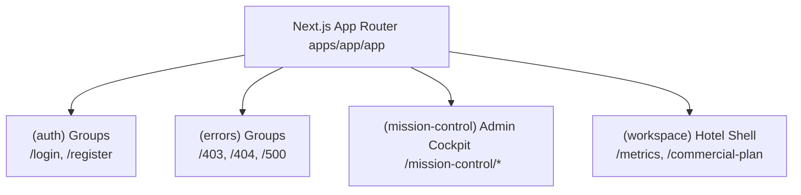

# Workspace Application Structure

This document outlines the architecture, directory routing patterns, and context boundaries of the REVREBEL Metrics Application located in `apps/app`.

---

## Architecture Overview

The Metrics Application is built on the **Next.js App Router** and organized into distinct **Route Groups** to enforce logical boundaries between standard user workspaces, administrative tools, authentication workflows, and system error bounds. 

---

## Directory Routing Topology

The application router uses Next.js Route Groups (folders enclosed in parentheses) to prevent path name collision and establish customized, independent layout structures.

### 1. Authentication Route Group `(auth)`
- **Path Context**: `/login`, `/register`, `/forgot-password`, `/reset-password`
- **Layout**: Encapsulates forms inside a centered, glassmorphic container with animated gradient orbs and grid overlays.
- **State Integrity**: Operations are simulated locally in React state to ensure static compilation without runtime dependencies.

### 2. Mission Control Administrative Cockpit `(mission-control)`
- **Path Context**: `/mission-control` and all administrative panels under `/mission-control/*`
- **Sub-routes**:
  - `/mission-control/apps` — Container Deployment & Pod Lifecycles
  - `/mission-control/users` — Operator Registry & Access Token Overrides
  - `/mission-control/permissions` — Granular Role-Based Access Control (RBAC) Matrix
  - `/mission-control/billing` — Financial Ledger & Plan Limits Utilization
  - `/mission-control/settings` — Core Global Environment Constants
  - `/mission-control/data-sources` — BigQuery Ingestion Sync & GA4 Connectors
  - `/mission-control/audit-logs` — Tamper-Proof Cryptographic Activity Ledger
- **Layout Shell**: Features a dark sidebar layout containing system status indicators, administrative links, and an escape route link returning to normal hotel workspaces (`/metrics`).
- **Decoupling**: Bypasses hotel-specific selectors, rendering as an administrative cockpit completely decoupled from user workspaces.

### 3. Core Workspace Route Group `(workspace)`
- **Path Context**: `/metrics`, `/commercial-plan`, `/growth-plan`, `/broadcast`, `/metrics-library`, `/playbook`, `/threads`, `/help-desk`
- **Layout Shell**: Renders the standard multi-pane layout: **Context Header -> Sidebar Explorer -> Center Canvas -> Collapsible Inspector**.
- **State Integration**: Anchored to the typed workspace provider for tenant resolution.

### 4. System Diagnostics Route Group `(errors)`
- **Path Context**: `/403`, `/404`, `/500`
- **Layout**: Employs a retro-futuristic radar scanning background with glitch-style error dialogs and system crash heap dump displays.

---

## State and Context Management

The core workspaces run on a centralized, typed context provider (`useWorkspace`) to propagate SBU and Hotel properties throughout the app without coupling logic to authentication states.

### Workspace Context Contract
- **Hotel Scope Resolution**: The provider loads hotel tenant attributes from predefined fixture profiles.
- **Strict Error Enforcement**: Hook `useWorkspace()` throws a clear error if executed outside of the workspace provider shell.
- **Database & Auth Decoupling**: No cookie or database storage assumptions are made at this layout layer. This enables isolated testing of routes, layouts, and panels.

---

## Package Topology & Monorepo Boundaries

The monorepo enforces clear separation between visual styling, documentation, and the application runtime.

1. **`@apps/app` (Application Tier)**:
   - Next.js App Router pages and client state controllers.
   - Leverages shared components and typography tokens.
2. **`@repo/ui` (Design Tier)**:
   - Houses reusable atomic visual components: Buttons, select menus, dialog frameworks, and the custom icons library.
   - Built on Tailwind CSS and Radix UI primitives.
3. **`@apps/docs` (Documentation Tier)**:
   - Houses technical architecture guides, developer setup logs, and system APIs schemas.
   - Powered by static MDX modules for fast compiling.

---

## Fixture Isolation & Deferred Implementations

To maintain maximum development velocity, the frontend is decoupled from hard API and database constraints:
- **No Direct SQL/API Calls**: Component templates pull from static TypeScript fixtures rather than directly querying database nodes.
- **Simulated Mutative Actions**: Process restarts, billing expansions, and token revocations utilize React timers and local states.
- **Static Compilation Integrity**: Routes are built statically (`pnpm build`) to ensure layouts can be audited and signed off before hooking up production telemetry databases.
