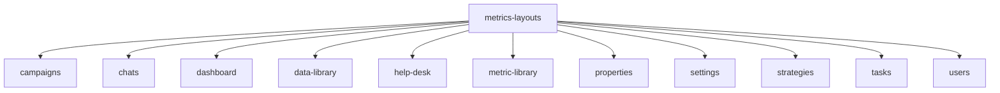
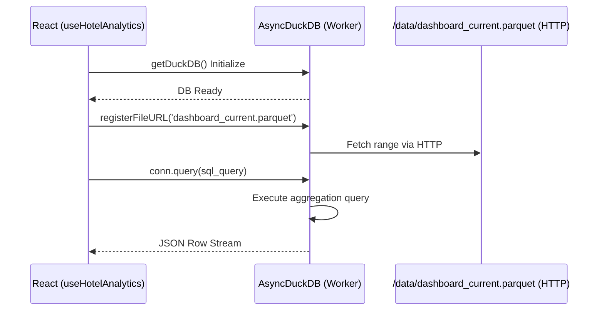
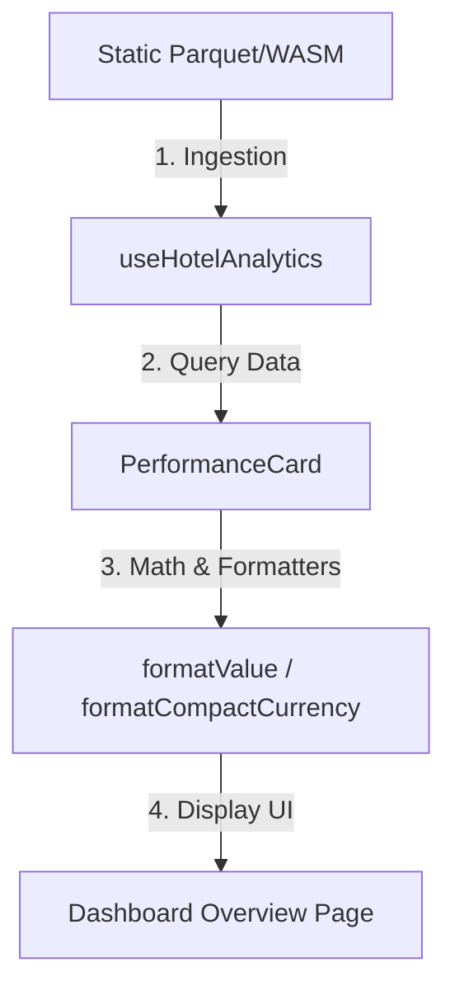

# Legacy Metrics Application Audit

This document presents a comprehensive, evidence-grounded migration audit and inventory of the legacy Metrics application (`Metrics-Core`) to support its eventual integration into the destination monorepo (`REBEL-APP`). It establishes a baseline of existing structures, framework patterns, and technical blockers to guide the migration sequence.

---

## Executive Summary

The legacy Metrics application (`Metrics-Core`) is a sophisticated hotel performance command center. However, it is not built with standard Next.js directory-based routing. Instead, it relies on a **client-side registry-driven architecture** where routing and layout compilation are performed dynamically inside an iframe preview container via ESM import maps. 

To migrate this application to `REBEL-APP` successfully, we must translate this dynamic playground-centric design into a standard Next.js App Router folder hierarchy. Furthermore, we must resolve a critical compilation blocker: legacy widgets import a dynamic hook `useDuckDb()` from a non-existent file path, which the playground injections resolve at runtime. In local execution, this must be systematically replaced with the physical `useHotelAnalytics()` client.

### Key Metrics Summary
*   **Total Feature Layouts**: 11 distinct functional modules.
*   **Critical Blockers**: Dynamic hook imports (`useDuckDb`), missing WASM/Parquet static assets, Tailwind postcss compilation boundaries.
*   **Icon Standard**: Complete elimination of `lucide-react` in favor of `@tabler/icons-react` and pre-compiled custom SVGs.

---

## Repository Verification

To prevent boundary contamination, we have verified the Git configuration, remotes, branches, and workspace paths of both repositories. Both operate as independent Git roots on the local machine under the parent `/Users/garystringham/github-revrebel/Migration/` directory.

| Attribute | Legacy Repository (`Metrics-Core`) | Destination Repository (`REBEL-APP`) |
| :--- | :--- | :--- |
| **Local Path** | `/Users/garystringham/github-revrebel/Migration/Metrics-Core` | `/Users/garystringham/github-revrebel/Migration/REBEL-APP` |
| **Active Branch** | `dev` | `storybook` |
| **Remote Origin** | `https://github.com/REVREBEL/Metrics-Core-Dep.git` | `https://github.com/REVREBEL/Metrics-Core.git` |
| **Working Tree** | Modified (untracked design documentation) | Clean |

---

## Framework and Tooling Comparison

The core package management and builder systems are closely aligned, using identical package managers and shared configurations. However, minor mismatches in compile-time tools (such as TypeScript versions) require careful isolation during migration.

| Dependency/Tool | Legacy (`Metrics-Core`) | Destination (`REBEL-APP`) | Status / Action |
| :--- | :--- | :--- | :--- |
| **Package Manager** | `pnpm@11.5.2` | `pnpm@11.5.2` | Fully aligned. No action needed. |
| **Next.js Version** | `^16.2.7` | `^16.2.7` | Fully aligned. |
| **React Version** | `^19.2.4` | `^19.2.4` | Fully aligned. |
| **TypeScript** | `6.0.3` (pre-cached compiler output) | `^5.9.3` (root) / `6.0.3` (`packages/ui`) | Legacy uses newer TS types. Ensure TS compilation strictness is aligned during migration. |
| **Linter / Formatter** | Biome `2.4.16` & Prettier | Biome `2.4.16` & Prettier | Fully aligned. |
| **Tailwind CSS** | `^4.3.0` (`@tailwindcss/postcss`) | `^4.3.0` (`@tailwindcss/postcss`) | Aligned. Both utilize Tailwind v4 variables. |

---

## Route Inventory

The Next.js `apps/app/app/` directory in the legacy repository is virtually empty except for a basic skeleton:
*   `apps/app/app/page.tsx` $\rightarrow$ Returns `<main>Customer App</main>`
*   `apps/app/app/layout.tsx` $\rightarrow$ Standard HTML wrap.

This is because **routing is client-side simulated** via:
1.  An iframe preview sandbox rendering compiled JS on-the-fly.
2.  Dynamic ESM import maps defined in `packages/ui/src/lib/modules.ts`.
3.  Registry metadata loaded from `packages/ui/src/lib/registry.ts` and `registry.metadata.json`.

For `REBEL-APP`, this architecture must be translated into standard **Next.js App Router folders** inside `apps/app/app/`.

### Proposed Route Mapping Table

| Feature Path | Legacy Layout / Component | Destination App Router Path |
| :--- | :--- | :--- |
| `/dashboard` | `dashboard/dashboard_homepage.tsx` | `apps/app/app/dashboard/page.tsx` |
| `/dashboard/segments` | `dashboard/segments_page.tsx` | `apps/app/app/dashboard/segments/page.tsx` |
| `/dashboard/channels` | `dashboard/channels_page.tsx` | `apps/app/app/dashboard/channels/page.tsx` |
| `/dashboard/room-types` | `dashboard/roomtypes_page.tsx` | `apps/app/app/dashboard/room-types/page.tsx` |
| `/dashboard/demand` | `dashboard/demand_page.tsx` | `apps/app/app/dashboard/demand/page.tsx` |
| `/dashboard/website` | `dashboard/website_page.tsx` | `apps/app/app/dashboard/website/page.tsx` |
| `/campaigns` | `campaigns/campaigns_layout.tsx` | `apps/app/app/campaigns/page.tsx` (redirects or index) |
| `/campaigns/performance` | `campaigns/performance_page.tsx` | `apps/app/app/campaigns/performance/page.tsx` |
| `/campaigns/active` | `campaigns/active_page.tsx` | `apps/app/app/campaigns/active/page.tsx` |
| `/campaigns/setup` | `campaigns/setup_page.tsx` | `apps/app/app/campaigns/setup/page.tsx` |
| `/chats` | `chats/chats_layout.tsx` | `apps/app/app/chats/page.tsx` |
| `/chats/assistant` | `chats/chat-assistant_page.tsx` | `apps/app/app/chats/assistant/page.tsx` |
| `/chats/new` | `chats/new_page.tsx` | `apps/app/app/chats/new/page.tsx` |
| `/data-library` | `data-library/data-library_layout.tsx` | `apps/app/app/data-library/page.tsx` |
| `/data-library/health` | `data-library/data-health_page.tsx` | `apps/app/app/data-library/health/page.tsx` |
| `/data-library/lookups` | `data-library/lookups_page.tsx` | `apps/app/app/data-library/lookups/page.tsx` |
| `/data-library/mappings` | `data-library/mappings_page.tsx` | `apps/app/app/data-library/mappings/page.tsx` |
| `/data-library/unmapped` | `data-library/unmapped-codes_page.tsx` | `apps/app/app/data-library/unmapped/page.tsx` |
| `/help-desk` | `help-desk/helpdesk_layout.tsx` | `apps/app/app/help-desk/page.tsx` |
| `/help-desk/docs` | `help-desk/documentation_page.tsx` | `apps/app/app/help-desk/docs/page.tsx` |
| `/metric-library` | `metric-library/metric-library_layout.tsx` | `apps/app/app/metric-library/page.tsx` |
| `/metric-library/base` | `metric-library/base_page.tsx` | `apps/app/app/metric-library/base/page.tsx` |
| `/metric-library/calculated` | `metric-library/calculated_page.tsx` | `apps/app/app/metric-library/calculated/page.tsx` |
| `/properties` | `properties/properties_layout.tsx` | `apps/app/app/properties/page.tsx` |
| `/properties/events` | `properties/events_page.tsx` | `apps/app/app/properties/events/page.tsx` |
| `/properties/lookups` | `properties/lookups_page.tsx` | `apps/app/app/properties/lookups/page.tsx` |
| `/properties/notes` | `properties/notes_page.tsx` | `apps/app/app/properties/notes/page.tsx` |
| `/properties/strategies` | `properties/strategies_page.tsx` | `apps/app/app/properties/strategies/page.tsx` |
| `/properties/tasks` | `properties/tasks_page.tsx` | `apps/app/app/properties/tasks/page.tsx` |
| `/settings` | `settings/settings_layout.tsx` | `apps/app/app/settings/page.tsx` |
| `/settings/profile` | `settings/profile_page.tsx` | `apps/app/app/settings/profile/page.tsx` |
| `/settings/notifications`| `settings/notifications_page.tsx` | `apps/app/app/settings/notifications/page.tsx` |
| `/settings/register` | `settings/register_page.tsx` | `apps/app/app/settings/register/page.tsx` |
| `/strategies` | `strategies/strategies_layout.tsx` | `apps/app/app/strategies/page.tsx` |
| `/strategies/recommended` | `strategies/recommended-actions_page.tsx`| `apps/app/app/strategies/recommended/page.tsx` |
| `/strategies/playbooks` | `strategies/playbooks_page.tsx` | `apps/app/app/strategies/playbooks/page.tsx` |
| `/strategies/triggers` | `strategies/triggers_page.tsx` | `apps/app/app/strategies/triggers/page.tsx` |
| `/tasks` | `tasks/tasks_layout.tsx` | `apps/app/app/tasks/page.tsx` |
| `/tasks/kanban` | `tasks/kanban_page.tsx` | `apps/app/app/tasks/kanban/page.tsx` |
| `/tasks/calendar` | `tasks/calendar-view_page.tsx` | `apps/app/app/tasks/calendar/page.tsx` |
| `/tasks/meeting-recap` | `tasks/meeting-recap_page.tsx` | `apps/app/app/tasks/meeting-recap/page.tsx` |
| `/tasks/owner-rollup` | `tasks/owner-rollup_page.tsx` | `apps/app/app/tasks/owner-rollup/page.tsx` |
| `/users` | `users/page.tsx` | `apps/app/app/users/page.tsx` |
| `/users/permissions` | `users/permissions-panel_page.tsx` | `apps/app/app/users/permissions/page.tsx` |
| `/users/verify` | `users/verify-email.tsx` | `apps/app/app/users/verify/page.tsx` |

---

## Application Shell and Providers

The application styling and themes are integrated deeply into the design tokens. To ensure smooth migration of the shell:

### Theme System
*   **Design Tokens**: Configured in `registry.ts` inside `REGISTRY_ITEMS` (CSS custom properties mapping oklch colors).
*   **Fonts**: The system defines 7 specific font-family stacks under `cssVars`:
    *   `font-sans` / `font-display` / `font-buttons`: `"Khand", sans-serif`
    *   `font-numbers`: `"Funnel Sans", sans-serif`
    *   `font-brand`: `"Barlow", sans-serif`
    *   `font-eyebrow`: `"Supreme", sans-serif`
    *   `font-serif`: `"Roboto", sans-serif`
    *   `font-mono`: `"Fira Code", monospace`
*   **Theme Provider**: Relies on `next-themes` (`ThemeProvider` configuration with default dark/light mode toggle in `ThemeSwitch`).

### Global Styles
*   Global variables must be loaded via CSS layers using Tailwind v4 `@theme` block directives.
*   The legacy CSS relies on custom utility classes like `.retro-shadow-primary-lg` and specialized layout utility classes which must be synchronized into `REBEL-APP`'s `packages/ui/src/styles/globals.css`.

---

## Feature Inventory

The legacy components are distributed across 11 subdirectories under `packages/ui/src/components/metrics-layouts/`.



### Detailed Feature Complexity Mapping

1.  **Dashboard (High Complexity)**
    *   *Path*: `packages/ui/src/components/metrics-layouts/dashboard`
    *   *Entrypoint*: `dashboard_homepage.tsx`
    *   *Sub-pages*: `website_page.tsx`, `demand_page.tsx`, `segments_page.tsx`, `roomtypes_page.tsx`, `channels_page.tsx`
    *   *Dependencies*: High reliance on `@/widgets/PerformanceCard`, `@/widgets/PerformanceCardOther`, `@/widgets/YearMonthSelector/dynamic`, `@/widgets/OTBStackedBarChart`, Recharts.
2.  **Tasks (High Complexity)**
    *   *Path*: `packages/ui/src/components/metrics-layouts/tasks`
    *   *Entrypoint*: `tasks_layout.tsx`
    *   *Sub-pages*: `kanban_page.tsx`, `calendar-view_page.tsx`, `meeting-recap_page.tsx`, `owner-rollup_page.tsx`
    *   *Dependencies*: Uses `tasks_provider.tsx` for shared contextual state, relies on complex state mutations via local API actions (`actions.ts`), utilizes drag-and-drop or column selection tables.
3.  **Users (Medium Complexity)**
    *   *Path*: `packages/ui/src/components/metrics-layouts/users`
    *   *Entrypoint*: `page.tsx`
    *   *Sub-pages*: `permissions-panel_page.tsx`, `verify-email.tsx`
    *   *Dependencies*: Uses `users_provider.tsx`, dialogs (`users-invite_dialog.tsx`, `users-delete_dialog.tsx`), and data tables with bulk action overlays.
4.  **Campaigns (Medium Complexity)**
    *   *Path*: `packages/ui/src/components/metrics-layouts/campaigns`
    *   *Entrypoint*: `campaigns_layout.tsx`
    *   *Sub-pages*: `performance_page.tsx`, `active_page.tsx`, `setup_page.tsx`
    *   *Dependencies*: Tab interfaces, Recharts visualizations, and form elements.
5.  **Strategies (Medium Complexity)**
    *   *Path*: `packages/ui/src/components/metrics-layouts/strategies`
    *   *Entrypoint*: `strategies_layout.tsx`
    *   *Sub-pages*: `recommended-actions_page.tsx`, `playbooks_page.tsx`, `triggers_page.tsx`
    *   *Dependencies*: Status badges, detail rows, action drawers.
6.  **Data Library (Medium Complexity)**
    *   *Path*: `packages/ui/src/components/metrics-layouts/data-library`
    *   *Entrypoint*: `data-library_layout.tsx`
    *   *Sub-pages*: `data-health_page.tsx`, `lookups_page.tsx`, `mappings_page.tsx`, `unmapped-codes_page.tsx`
    *   *Dependencies*: Mapping edit drawer (`mapping-row-edit_drawer.tsx`), data manager tables.
7.  **Properties (Medium Complexity)**
    *   *Path*: `packages/ui/src/components/metrics-layouts/properties`
    *   *Entrypoint*: `properties_layout.tsx`
    *   *Sub-pages*: `events_page.tsx`, `lookups_page.tsx`, `notes_page.tsx`, `strategies_page.tsx`, `tasks_page.tsx`, `page.tsx`
    *   *Dependencies*: Direct property view routing simulation, layout sub-navs.
8.  **Chats (Low Complexity)**
    *   *Path*: `packages/ui/src/components/metrics-layouts/chats`
    *   *Entrypoint*: `chats_layout.tsx`
    *   *Sub-pages*: `chat-assistant_page.tsx`, `new_page.tsx`
    *   *Dependencies*: Chat bubble wrappers, prompt helper cards.
9.  **Metric Library (Low Complexity)**
    *   *Path*: `packages/ui/src/components/metrics-layouts/metric-library`
    *   *Entrypoint*: `metric-library_layout.tsx`
    *   *Sub-pages*: `base_page.tsx`, `calculated_page.tsx`
    *   *Dependencies*: Simple lookup listings, formula displays.
10. **Settings (Low Complexity)**
    *   *Path*: `packages/ui/src/components/metrics-layouts/settings`
    *   *Entrypoint*: `settings_layout.tsx`
    *   *Sub-pages*: `profile_page.tsx`, `notifications_page.tsx`, `register_page.tsx`
    *   *Dependencies*: Profile and notification settings forms (`profile_form.tsx`, `notifications_form.tsx`).
11. **Help Desk (Low Complexity)**
    *   *Path*: `packages/ui/src/components/metrics-layouts/help-desk`
    *   *Entrypoint*: `helpdesk_layout.tsx`
    *   *Sub-pages*: `helpdesk_page.tsx`, `documentation_page.tsx`
    *   *Dependencies*: Simple documentation layout and markdown rendering container.

---

## Data Sources and API Clients

The application features a unique client-side processing model for analytical data combined with mocked servers for standard transaction states.

### Client-Side Analytics (DuckDB WASM)
The core analytics hook is located in `packages/ui/src/hooks/use-hotel-analytics.ts`. It initializes a client-side database as a web worker and queries local Parquet archives.



#### SQL Ingestion Query
DuckDB is parameterized by hotelName, year, and month. Key calculations are performed on-the-fly inside the SQL statement:
```sql
SELECT
  property_name,
  SUM(rooms_cy) as rooms_cy,
  SUM(revenue_cy) as revenue_cy,
  SUM(rooms_ly_actual) as rooms_ly_actual,
  SUM(rev_ly_actual) as rev_ly_actual,
  SUM(rev_budget) as rev_budget,
  SUM(rooms_budget) as rooms_budget,
  SUM(available_rooms) as available_rooms,
  
  -- Weighted calculations over the entire time frame
  SUM(rooms_cy) / NULLIF(SUM(available_rooms), 0) as occ_cy,
  SUM(rooms_ly_actual) / NULLIF(SUM(available_rooms), 0) as occ_py,
  SUM(rooms_budget) / NULLIF(SUM(available_rooms), 0) as occ_budget,
  SUM(revenue_cy) / NULLIF(SUM(rooms_cy), 0) as adr_cy,
  SUM(rev_ly_actual) / NULLIF(SUM(rooms_ly_actual), 0) as adr_py,
  SUM(rev_budget) / NULLIF(SUM(rooms_budget), 0) as adr_budget,
  SUM(revenue_cy) / NULLIF(SUM(available_rooms), 0) as revpar_cy,
  SUM(rev_ly_actual) / NULLIF(SUM(available_rooms), 0) as revpar_py,
  SUM(rev_budget) / NULLIF(SUM(available_rooms), 0) as revpar_budget,

  -- Variances
  (SUM(rooms_cy) / NULLIF(SUM(available_rooms), 0)) - (SUM(rooms_ly_actual) / NULLIF(SUM(available_rooms), 0)) as occ_var,
  (SUM(revenue_cy) / NULLIF(SUM(rooms_cy), 0)) - (SUM(rev_ly_actual) / NULLIF(SUM(rooms_ly_actual), 0)) as adr_var,
  (SUM(revenue_cy) / NULLIF(SUM(available_rooms), 0)) - (SUM(rev_ly_actual) / NULLIF(SUM(available_rooms), 0)) as revpar_var,
  SUM(rooms_cy) - SUM(rooms_ly_actual) as rooms_var,
  SUM(revenue_cy) - SUM(rev_ly_actual) as revenue_var,
  SUM(rev_budget) - SUM(revenue_cy) as rev_to_budget,
  SUM(revenue_cy) / NULLIF(SUM(rev_budget), 0) as budget_reach_pct
FROM (
  SELECT
    *,
    -- Normalize the stay_date from both string or structure
    CAST(regexp_extract(stay_date::VARCHAR, '([0-9]{4}-[0-9]{2}-[0-9]{2})') AS DATE) as normalized_stay_date
  FROM read_parquet('dashboard_current.parquet')
)
WHERE property_name = '${escapedHotelName}'
  AND date_part('year', normalized_stay_date) = ${year}
  AND date_part('month', normalized_stay_date) = ${month}
GROUP BY property_name;
```

### Mock Transaction Persistence
For writing/updating states (e.g. inviting a user or updating a task), the legacy application simulates Next.js server actions using **in-memory global `Map` singletons** inside layout folders.
For instance, in `packages/ui/src/components/metrics-layouts/tasks/actions.ts`:
*   `assigneesStore = new Map<string, ExternalAssigneeRow[]>()`
*   Functions like `createExternalAssigneeAction` push data directly into this `Map` memory cache instead of writing to a database.
*   *Migration Impact*: These mocks must either be copied exactly to preserve simulated performance, or wired into physical database clients (`@repo/db`) during subsequent integration phases.

---

## Metric Domain Logic

Analytical figures are computed and formatted locally on-the-fly.

### Core Metrics Calculations
Calculations strictly follow standard hotel performance math:
1.  **Occupancy (OCC)**: $\text{Rooms Booked} \div \text{Available Rooms}$. Expressed as a percentage (e.g. `67.2%`).
2.  **Average Daily Rate (ADR)**: $\text{Room Revenue} \div \text{Rooms Booked}$. Expressed as currency (e.g. `$323.19`).
3.  **Revenue Per Available Room (RevPAR)**: $\text{Room Revenue} \div \text{Available Rooms}$. Expressed as currency (e.g. `$156.16`).
4.  **Variances (var)**: Calculated as current performance minus prior performance (e.g. `Current ADR` - `LY ADR`).

### Formatting Logic
The formatters are built as localized helpers (e.g. inside `performance-card.tsx`):
*   `formatValue(value, format)`: Converts raw numbers into formatted currency, rounded percentages, or localized thousands strings:
    ```typescript
    if (format === "currency") {
      return new Intl.NumberFormat("en-US", {
        style: "currency",
        currency: "USD",
        maximumFractionDigits: value % 1 === 0 ? 0 : 2,
      }).format(value);
    }
    ```
*   `formatCompactCurrency(value)`: Compacts large metrics by dividing by $1000$ and suffixing with a lowercase `k` (e.g., `408021` $\rightarrow$ `$408k`).
*   `toNumber(value)`: Gracefully falls back to `0` if a metric is null, undefined, or non-finite.

---

## State Management

State flows rely primarily on simple React state models and local React contexts.

1.  **Jotai**: Though available in playground ESM maps (`jotai@2.17.1`), Jotai is not used inside the 11 layout directories.
2.  **React Context**:
    *   **Tasks Context**: `tasks_provider.tsx` handles complex task modifications, column filtering, active hotel boundaries, and bulk selection states.
    *   **Users Context**: `users_provider.tsx` coordinates active users state, invite overlays, and batch deletions.
3.  **Dynamic Playground Adapter**: `registry-adapter.ts` converts standard component metadata into adaptable registry blocks for the custom iframe environment. This adapter can be retired during standard Next.js migration.

---

## Environment Variables

The legacy system depends on several configuration settings. These variables must be configured in `REBEL-APP/apps/app/.env.local`.

| Variable Name | Role / Purpose | Fallback / Safe Handling |
| :--- | :--- | :--- |
| `NEXT_PUBLIC_APP_URL` | Fallback absolute base URL for the client worker. | `http://localhost:3200` |
| `NEXT_PUBLIC_TEST_DATE` | Mock reference date for analytics calculations. | `2026-01-01` |
| `NEXT_PUBLIC_API_URL` | API endpoint for analytics fallback data. | `http://localhost:3204/api` |
| `NEXT_PUBLIC_MOCK_AUTH` | Toggles standard credentials simulation bypass. | `true` |

---

## Dependency Comparison

The package manifests are largely compatible, but there are notable differences in specific package dependencies that require coordination.

| Package | Legacy (`Metrics-Core/packages/ui`) | Destination (`REBEL-APP/packages/ui`) | Resolution Action |
| :--- | :--- | :--- | :--- |
| `lucide-react` | `^1.0.0` (dependencies) | `^1.0.0` (dependencies) | **Banned**. Lucide must be removed and replaced. |
| `@tabler/icons-react` | `^3.44.0` (dependencies) | `^3.44.0` (devDependencies) | Promote to `dependencies` in the destination package. |
| `recharts` | `^3.0.0` | `^3.0.0` | Aligned. |
| `@base-ui/react` | `^1.5.0` | `^1.5.0` | Aligned. |
| `@tanstack/react-table`| `^8.21.3` | `^8.21.3` | Aligned. |
| `motion` | `^12.40.0` | `^12.40.0` | Aligned. |
| `date-fns` | `^4.1.0` | `^4.1.0` | Aligned. |
| `@dnd-kit/core` | *Not listed* | `^6.3.1` | Destination contains additional DnD utilities. |

---

## UI Component Mapping

Legacy components map closely to destination UI primitives, but icon usage requires strict enforcement.

### Primitives Mapping
The legacy widgets use a custom primitive import path `@/components/primitives/*`. These must be mapped directly to `REBEL-APP`'s custom shadcn-style UI primitives:
*   `@/components/primitives/card` $\rightarrow$ `@/components/ui/card` or `@repo/ui` primitives.
*   `@/components/primitives/dialog` $\rightarrow$ `@/components/ui/dialog`.
*   `@/components/primitives/tabs` $\rightarrow$ `@/components/ui/tabs`.

### STRICT Lucide Icon Ban and Mapping Strategy
Lucide icons are strictly banned in the destination repository. During migration, all icons must be systematically replaced with:
1.  **Tabler Icons**: Import directly from `@tabler/icons-react`.
2.  **Custom Inline SVGs**: Use pre-compiled custom SVG React components located in `packages/ui/src/icons/` (e.g. `ArrowCircleDown`, `ArrowCircleUp`, `ArrowLeft`).

#### Icon Mapping Examples
*   `lucide-react` `ArrowDown` $\rightarrow$ `@/icons/DirectionalSvg/ArrowDown` or `@tabler/icons-react` `IconArrowDown`
*   `lucide-react` `Trash` $\rightarrow$ `@/icons/Trash` or `@tabler/icons-react` `IconTrash`
*   `lucide-react` `Settings` $\rightarrow$ `@tabler/icons-react` `IconSettings`
*   `lucide-react` `Search` $\rightarrow$ `@tabler/icons-react` `IconSearch`

---

## Static Assets

Client-side DuckDB execution relies heavily on static assets which are completely missing from the legacy source code repository. During migration, these static assets must be copied directly into `REBEL-APP/apps/app/public/`.

### Required Static File Trees

```
apps/app/public/
├── duckdb/
│   ├── duckdb-mvp.wasm
│   ├── duckdb-browser-mvp.worker.js
│   ├── duckdb-eh.wasm
│   └── duckdb-browser-eh.worker.js
└── data/
    └── dashboard_current.parquet
```

> [!CAUTION]
> If these static files are missing, the client-side database will fail to initialize. This will result in silent analytical load failures (perpetual skeleton loading states) on the performance cards.

---

## Proposed Destination Ownership

When migrating the codebase, legacy modules must be systematically mapped to appropriate destination packages to maintain monorepo decoupling standards.

```mermaid
graph TD
    Legacy[Legacy Codebase] --> |11 Layouts| App[apps/app]
    Legacy --> |useHotelAnalytics / DB Utilities| Data[packages/data (Proposed)]
    Legacy --> |Formatters / Calculations| Metrics[packages/metrics (Proposed)]
    Legacy --> |Custom Buttons / Tables / Cells| UI[packages/ui]
```

*   **apps/app**: Should strictly own standard App Router page wrappers, directory layouts, and route definitions.
*   **packages/ui**: Should strictly own presentation primitives, custom tables, charts, dialogs, buttons, and custom SVGs.
*   **packages/data (Proposed)**: Should house the DuckDB analytics hooks (`useHotelAnalytics.ts`) and any eventual database query interfaces to decouple UI logic from ingestion routines.
*   **packages/metrics (Proposed)**: Should encapsulate core financial calculations (OCC, ADR, RevPAR formulas) and unified compact formatting utilities for cross-application consistency.

---

## Migration Risks and Blockers

> [!IMPORTANT]
> The following four items represent major compilation and execution hazards. They must be resolved before standard application boots can succeed.

### 1. Dynamic Hook Resolution Blocker (`useDuckDb`)
*   **The Problem**: Legacy core widgets (such as `performance-card.tsx` and `otb-stacked-bar-chart.tsx`) import `useDuckDb` from `@/hooks/useDuckDb` or `@hooks`. However, there is **no physical file** `useDuckDb.ts`. This hook is dynamically injected as an ESM mock by the playground compile adapter (`registry-adapter.ts`).
*   **The Danger**: Compiling these widgets locally in a standard Next.js App Router environment will throw immediate file-not-found TypeScript or Webpack resolution errors.
*   **The Mitigation**: During the vertical slice migration, we must replace all dynamic `useDuckDb` references with the concrete physical client `useHotelAnalytics()`, or author a physical file `@/hooks/useDuckDb.ts` that acts as a wrapper exporting the initialized analytics hooks.

### 2. WASM Worker Bundle Isolation
*   **The Problem**: Client-side worker engines (`new Worker(bundle.mainWorker!)`) require same-origin sandboxing. If static paths `/duckdb/*` are not served with correct CORS and Content-Type headers, the browser will refuse to compile the assembly engine.
*   **The Danger**: Blocked queries, cross-origin scripting errors, or memory allocation failures on mobile viewports.

### 3. Tailwind Postcss Dynamic Class Compilation
*   **The Problem**: Legacy modules contain dynamically evaluated or inline-mapped tailwind selectors (e.g. `data-[state=on]:border-current`, `color-mix` functions).
*   **The Danger**: Tailwind CSS v4 might purge or fail to recognize these dynamic templates during static optimization passes, leaving widgets without core retro-tech styling rules.

### 4. TypeScript Version Mismatches
*   **The Problem**: Legacy utilizes TS compiler `6.0.3` dependencies whereas destination uses `^5.9.3` at the monorepo root.
*   **The Danger**: Subtle type casting discrepancies (such as read-only tuple allocations or Next.js route parameter typing changes) could trigger build pipeline failures.

---

## Recommended First Vertical Slice

To prove out the database integration and visual styles without triggering widespread compilation failures, we propose migrating a single isolated, high-impact vertical slice first.

### Slice: **Dashboard Overview Performance Card**



#### Step-by-Step Execution Plan:
1.  **Stage Assets**: Copy the required `.wasm` bundles and `/data/dashboard_current.parquet` archive into `apps/app/public/`.
2.  **Migrate Hook**: Port `use-hotel-analytics.ts` to `packages/ui/src/hooks/`. Correct asset paths to resolve relative to `window.location.origin`.
3.  **Adapt Core Card**: Copy `performance-card.tsx` to `packages/ui/src/components/metrics-core/`.
4.  **Replace Dynamic Hook**: Modify the card imports to replace the dynamic `useDuckDb` statement with a standard `useHotelAnalytics()` hook wrapper:
    ```typescript
    // Replace: import { useDuckDb } from "@/hooks/useDuckDb";
    // With:
    import { useHotelAnalytics } from "@/hooks/use-hotel-analytics";
    ```
5.  **Enforce Icon Standards**: Replace custom arrows with pre-compiled custom SVGs (`ArrowCircleDown`, `ArrowCircleUp`). Verify zero `lucide-react` references are left.
6.  **Create Standard Route**: Establish the directory `apps/app/app/dashboard/` and draft a standard `page.tsx` that renders the migrated performance card wrapped in the global theme container.
7.  **Verify**: Launch the Next.js development server and verify the card fetches, aggregates, and renders SQL data successfully.

---

## Recommended Migration Sequence

An incremental, 11-step sequence is recommended to ensure monorepo integrity and avoid parallel compile-time issues.

```mermaid
gridParams
  columns 3
```
```carousel
### Step 1: Pre-requisite Assets
*   **Action**: Copy WASM workers and parquet database archives into `apps/app/public/`.
*   **Reason**: Ensures immediate runtime accessibility for analytical modules.
<!-- slide -->
### Step 2: Hook Stabilization
*   **Action**: Port `use-hotel-analytics.ts` to `packages/ui/src/hooks/`.
*   **Reason**: Establishes standard client-side SQL query capabilities.
<!-- slide -->
### Step 3: Icon Integration
*   **Action**: Coordinate `@tabler/icons-react` and custom SVG components in `packages/ui`.
*   **Reason**: Supports the strict Lucide icon ban.
<!-- slide -->
### Step 4: Core Widgets Porting
*   **Action**: Port the 10 legacy analytical widgets (e.g. `PerformanceCard`, `OTBStackedBarChart`).
*   **Reason**: Decouples presentation logic and replaces missing dynamic hook imports.
<!-- slide -->
### Step 5: Route Layout Prep
*   **Action**: Construct the Next.js App Router folders inside `apps/app/app/`.
*   **Reason**: Initializes standard routing targets.
<!-- slide -->
### Step 6: Port Dashboard Feature
*   **Action**: Port the Dashboard layout and its 5 sub-pages.
*   **Reason**: Establishes the analytical backbone of the app.
<!-- slide -->
### Step 7: Port Task Management
*   **Action**: Port the Tasks layout, sub-pages, context provider, and actions map.
*   **Reason**: Handles highly complex interactive state operations.
<!-- slide -->
### Step 8: Port Mid-Complexity Features
*   **Action**: Port Campaigns, Users, Strategies, and Data Library layouts.
*   **Reason**: Resolves transactional management boundaries.
<!-- slide -->
### Step 9: Port Low-Complexity Features
*   **Action**: Port Settings, Help Desk, Metric Library, and Chat modules.
*   **Reason**: Completes the core application features.
<!-- slide -->
### Step 10: Build Optimization
*   **Action**: Execute clean-room Biome lint checks and compiler checks on `@apps/app`.
*   **Reason**: Eliminates TypeScript type casting errors or formatting bugs.
<!-- slide -->
### Step 11: Production Pipeline Build
*   **Action**: Run full Next.js static compilation and optimize bundles.
*   **Reason**: Confirms production readiness.
```

---

## Deferred and Retired Items

Several components from the legacy registry or playground framework are **explicitly retired** or deferred during this migration to optimize monorepo health.

1.  **ESM Bare Imports Rewriter (`modules.ts`)**: Since routing will be directory-based and compiled by Next.js/Turbopack, the dynamic rewriter and import map modules are completely obsolete and retired.
2.  **Iframe Preview Container (`iframe-html.ts`, `registry.visual-previews.tsx`)**: The simulated sandboxed runtime is retired in favor of native App Router hot-reloading and Storybook components.
3.  **Dynamic Playground Adapter (`registry-adapter.ts`)**: Obsolete once custom widgets are mounted inside native React components.
4.  **Local Dev Start Utilities (`start-dev.sh`)**: Obsolete since `REBEL-APP` utilizes standard pnpm workspace filter commands.

---

## Appendix: Legacy Core Widget Specifications

For reference during the core porting phase, the following core analytical widgets are identified with their corresponding physical legacy file paths:

*   `@/widgets/PerformanceCard` $\rightarrow$ `packages/ui/src/components/metrics-core/performance-card.tsx`
*   `@/widgets/PerformanceCardOther` $\rightarrow$ `packages/ui/src/components/metrics-core/performance-card-other.tsx`
*   `@/widgets/YearMonthSelector/dynamic` $\rightarrow$ `packages/ui/src/components/_shared-ui/controls/year-month-selector.tsx`
*   `@/widgets/MarketSegmentTransientRoomsTable` $\rightarrow$ `packages/ui/src/components/metrics-tables/market-segment-transient-rooms-table.tsx`
*   `@/widgets/MarketSegmentGroupRoomsTable` $\rightarrow$ `packages/ui/src/components/metrics-tables/market-segment-group-rooms-table.tsx`
*   `@/widgets/OTBStackedBarChart` $\rightarrow$ `packages/ui/src/components/metrics-charts/otb-stacked-bar-chart.tsx`
*   `@/widgets/BudgetSnapshotCard` $\rightarrow$ `packages/ui/src/components/metrics-core/budget-snapshot-card.tsx`
*   `@/widgets/ConversionCard` $\rightarrow$ `packages/ui/src/components/metrics-core/conversion-card.tsx`
*   `@/widgets/SocialVisitsCard` $\rightarrow$ `packages/ui/src/components/metrics-core/social-visits-card.tsx`
*   `@/widgets/BrowserStatsCard` $\rightarrow$ `packages/ui/src/components/metrics-core/browser-stats-card.tsx`
